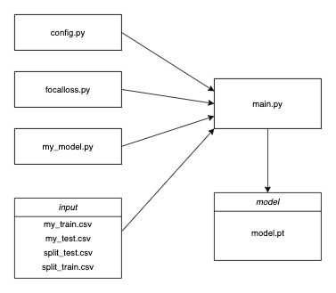
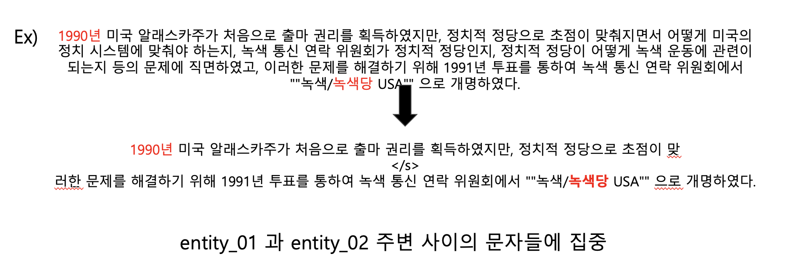

## 구조

## 아이디어

**Input(데이터 폴더)**

My_train, my_test => 주어진 기본 데이터셋

Split_test, split_train  => entity1과 entity2 주변 사이의 문자들에 집중하여 전체 문장의 길이를 줄인 데이터셋

**focalloss.py** 

 매우 불균형한 data set이였기에 focalloss 사용

**My_model.py** 

 huggingface 라이브러리의 분류기와 다르게 lstm 모델을 뒤에 부착하여 사용

**main.py** 

random mask : 배치마다 다른 확률값을 부여하여 랜덤으로 mask 생성

Ex) 이순신은 조선 중기의 무신이다. => 이순신은 <mask> 중기의 무신이다.

random switching : 문장의 위치를 switching (1/3 ~ 2/3 지점에서 )

Ex) 이순신은 조선 중기의 무신이다. => 무신이다. 이순신은 조선 중기의

**Add weight** 

주어진 데이터 셋의 분포는 관계없음 라벨 (0)이 약 50%정도로 높게 분포 + validation set의 틀린 비율 중 0이 매우 높았다.

=> 최종 output에 0.1정도의 가중치를 부여하여 최종 결과물

대부분의 모델에서 효과를 보였다.

## OPTION

--epochs : epoch 수 (default : 10)

--batch_size : 배치 사이즈 (default : 32)

--lr : learning rate (default : 0.0001)

--model_name : pretrained model name (default : xlm-roberta-large)

--add_vocab : vocab 추가여부 (default : False)

--add_lstm :  분류기 이전 lstm 추가여부 (default : False)

--mask : mask 추가여부 (default : False)

--switch : 문장 switch 여부 (default : False)

## How to use

python3 main.py --epoch 15 --lr 0.00001 --batch_size 32 --model_name xlm-roberta-large -- mask 1 (단일 모델 structure 기준 최고 성능 81.4)

